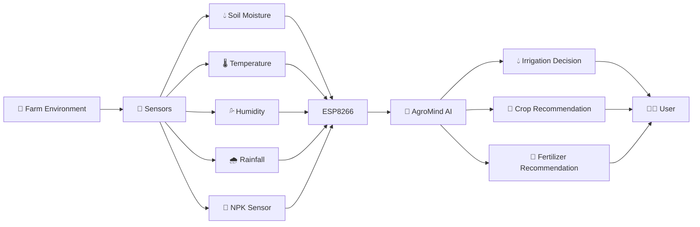
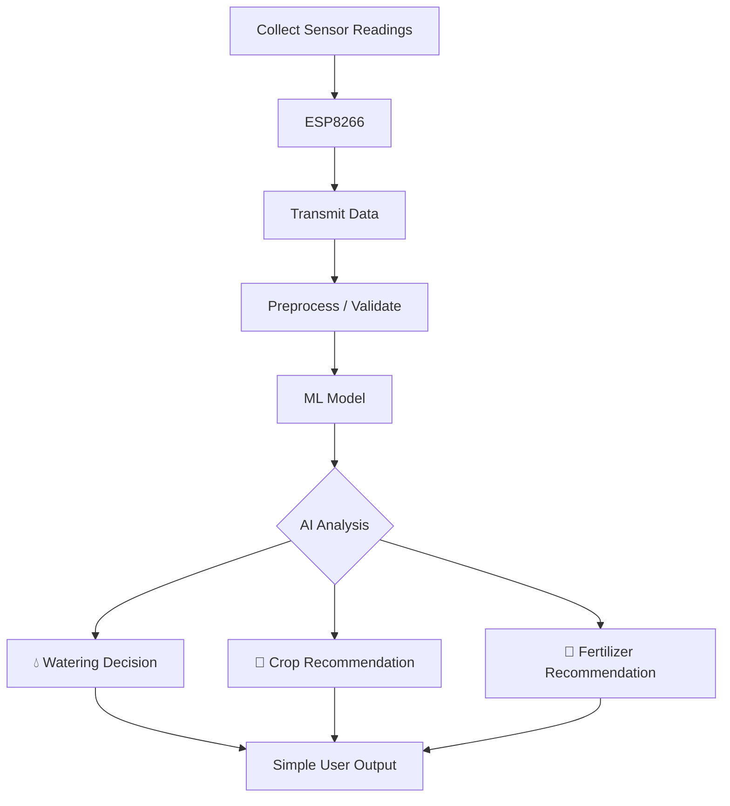

# 🌱 AgroMind

### **Sense. Analyze. Decide. Grow.**

> **An IoT + AI system that transforms real-time farm conditions into actionable agricultural decisions.**

**AgroMind** combines affordable IoT sensors with open-source AI to help farmers answer three practical questions:

### 💧 **Does the crop need water?**
### 🌾 **Which crop is suitable?**
### 🧪 **What fertilizer is recommended?**

---

# 1. 🎯 Problem Statement

Farmers often have access to information about their fields, but **raw information does not always lead to better decisions**.

Soil moisture, temperature, humidity, rainfall, and nutrient levels continuously affect crop growth. However, checking these values individually does not answer the most important question:

> **"What should I do with this information?"**

Over-irrigation can waste water, while insufficient irrigation can affect crop health. Similarly, selecting a crop or fertilizer without considering soil and environmental conditions can lead to poor outcomes.

**AgroMind aims to turn field data into decisions.**

---

# 2. 🌱 Project Overview

AgroMind is a proposed **IoT + Machine Learning based agricultural decision-support system**.

Sensors collect real-time field conditions, an **ESP8266** transmits the readings, and an AI model analyzes them to generate simple recommendations.

```text
🌱 REAL WORLD
     ↓
📡 SENSORS
     ↓
ESP8266
     ↓
🧠 AGROMIND AI
     ↓
💧 WATER?  +  🌾 WHICH CROP?  +  🧪 WHICH FERTILIZER?
```

---

# 3. 💡 Proposed Solution

AgroMind connects key environmental and soil parameters:

**💧 Soil Moisture | 🌡️ Temperature | 💦 Humidity | 🌧️ Rainfall | 🧪 NPK**

The readings are passed to a machine-learning layer.

The system focuses on three agricultural decisions:

- 💧 **Irrigation Recommendation** — whether watering is needed.
- 🌾 **Crop Recommendation** — a suitable crop based on learned agricultural patterns.
- 🧪 **Fertilizer Recommendation** — an appropriate fertilizer recommendation based on the soil's **Nitrogen (N), Phosphorus (P), and Potassium (K)** levels.

The NPK-based fertilizer recommendation is part of the **proposed extended system architecture** and can be incorporated when NPK sensing is available.

> **Instead of simply showing what is happening in the field, AgroMind suggests what could be done next.**

---

# 4. 🚀 Objectives

- Monitor important environmental and soil conditions.
- Reduce unnecessary irrigation through data-driven recommendations.
- Recommend crops according to detected conditions.
- Use NPK levels to support fertilizer recommendations.
- Demonstrate a practical **IoT → AI → Decision** pipeline.
- Build the prototype using accessible, low-cost technologies.
- Create an architecture that can be expanded into a larger smart-farming platform.

---

# 5. 👨‍🌾 Target Users / Use Case

### Primary
**Small and medium-scale farmers**

### Potential Future Users
- Agricultural advisors
- Precision-farming initiatives
- Agricultural researchers and students
- Smart-farming projects

### Example Use Case

A farmer checks the system:

```text
🌡️ Temperature     29°C
💦 Humidity         68%
💧 Soil Moisture    31%
🌧️ Rainfall        Low
🧪 NPK              Detected

        ↓

🧠 AGROMIND

💧 Watering    → RECOMMENDED
🌾 Crop        → MODEL RECOMMENDATION
🧪 Fertilizer  → NPK-BASED RECOMMENDATION
```

---

# 6. 🤖 Open-Source AI Technology Selected

### **Random Forest + Scikit-learn**

AgroMind proposes a **Random Forest machine-learning model** using the open-source **Scikit-learn** ecosystem.

The model can use environmental and soil parameters such as moisture, temperature, humidity, rainfall, and NPK values to support agricultural recommendations.

Appropriate open agricultural datasets will be selected during implementation.

---

# 7. 💭 Why This Technology Was Selected

Random Forest is a strong fit for our prototype because it:

- 🌾 Works well with structured agricultural data.
- 📊 Handles multiple input features.
- ⚡ Is fast to train and evaluate.
- 💻 Has relatively low computational requirements.
- 🔍 Is easier to interpret than many complex deep-learning approaches.
- 🚀 Can be improved as more real-world data becomes available.

It gives us a realistic balance between **AI capability and a 10-hour hackathon implementation window**.

---

# 8. 🧠 AI's Role in the System

AI is the **decision-making layer**, not merely a chatbot.

```text
     Sensor Data
         │
         ▼
┌────────────────────┐
│    AGROMIND AI     │
│                    │
│ Pattern Analysis   │
│        +           │
│ Prediction         │
└──────────┬─────────┘
           │
      ┌────┼────┐
      ▼    ▼    ▼
   💧 WATER 🌾 CROP 🧪 FERTILIZER
   DECISION   RECOMMENDATION
```

The AI converts multiple environmental and soil signals into understandable agricultural recommendations.

---

# 9. 🏗️ System Architecture



### Core Architecture

**Sensing → Communication → AI Processing → Decision → User**

---

# 10. 🔄 Data / Information Flow



The objective is to keep the data path simple enough to build and demonstrate reliably during the hackathon.

---

# 11. 🧩 Component-Level Architecture

| Component | Responsibility |
|---|---|
| 💧 Soil Moisture Sensor | Measures soil water level |
| 🌡️ Temperature Sensor | Measures surrounding temperature |
| 💦 Humidity Sensor | Measures atmospheric humidity |
| 🌧️ Rainfall Sensor | Detects rainfall conditions |
| 🧪 NPK Sensor | Measures soil Nitrogen, Phosphorus & Potassium levels |
| 📡 ESP8266 | Collects and transmits sensor data |
| 🧠 ML Model | Analyzes conditions and generates recommendations |
| 🐍 Python Layer | Handles processing and model integration |
| 🖥️ Interface | Presents recommendations clearly |

**Note:** NPK sensing is part of the proposed extended architecture; the initial physical prototype may not include the NPK hardware.

---

# 12. 🔗 Data / Information Flow Summary

```text
REAL WORLD
    ↓
Sensors capture conditions
    ↓
ESP8266 collects readings
    ↓
Data is transmitted
    ↓
AI analyzes the conditions
    ↓
┌──────────────────────────┐
│ 💧 Watering Decision     │
│ 🌾 Crop Recommendation   │
│ 🧪 Fertilizer Suggestion │
└──────────────────────────┘
    ↓
Farmer receives simple output
```

---

# 13. 🤝 Agentic Workflow

### **Not applicable to the initial prototype.**

AgroMind's first version focuses on a **predictive ML pipeline**, where sensor inputs are analyzed to generate recommendations.

However, a future agentic version could introduce an agricultural AI agent capable of:

```text
Observe → Analyze → Plan → Recommend → Learn
```

It could combine sensor readings with weather forecasts, historical field data, and crop information to generate more comprehensive farming recommendations.

---

# 14. 🛠️ Technology Stack

| Layer | Technology |
|---|---|
| Hardware | ESP8266 |
| Sensors | Moisture, Temperature, Humidity, Rainfall, NPK |
| AI/ML | Scikit-learn / Random Forest |
| Programming | Python |
| Data Processing | Pandas, NumPy |
| Communication | ESP8266 wireless communication |
| Interface | Lightweight Web UI |
| Training Data | Open agricultural dataset |

---

# 15. ✨ Expected Features

### Core Features

- 📡 Real-time sensor data collection
- 💧 Soil moisture monitoring
- 🌡️ Temperature monitoring
- 💦 Humidity monitoring
- 🌧️ Rainfall detection
- 🧪 NPK-based soil nutrient analysis
- 🧠 ML-based analysis
- 💧 Irrigation recommendation
- 🌾 Crop recommendation
- 🧪 Fertilizer recommendation
- 📊 Simple, understandable output

### Design Principle

> **Minimum complexity. Maximum useful information.**

---

# 16. ⚙️ Implementation Approach

The prototype will be developed in focused stages during the live hackathon:

```text
① Dataset & Environment
          ↓
② Train ML Model
          ↓
③ Connect Sensors + ESP8266
          ↓
④ Integrate IoT with AI
          ↓
⑤ Build Simple Interface
          ↓
⑥ Test End-to-End Pipeline
```

### ⏱️ 10-Hour Priority

The primary goal is a **working end-to-end demonstration**.

The core prototype will prioritize **irrigation + crop recommendation**, while the NPK/fertilizer capability can be demonstrated as an extended architectural feature if hardware and time permit.

---

# 17. 📤 Expected Final Output

The proposed system can provide an output similar to:

```text
╔════════════════════════════════╗
║         🌱 AGROMIND AI         ║
╠════════════════════════════════╣
║ 🌡️ Temperature    29°C        ║ 
║ 💦 Humidity        68%        ║
║ 💧 Soil Moisture   31%        ║
║ 🌧️ Rainfall        Low        ║
║ 🧪 NPK             Detected   ║
╠════════════════════════════════╣
║ 💧 WATERING                   ║
║ → Watering Recommended        ║
║                               ║
║ 🌾 CROP                       ║
║ → Model Recommendation        ║
║                               ║
║ 🧪 FERTILIZER                ║
║ → NPK-Based Recommendation    ║
╚════════════════════════════════╝
```

The exact interface will be refined during implementation.

---

# 18. 📈 Future Scope / Scalability

AgroMind can evolve from a prototype into a broader smart-farming platform.

### Future possibilities

**🌦️ Weather Intelligence**  
Combine live weather forecasts with sensor readings.

**🧪 Advanced Soil Analysis**  
Use pH, NPK and additional soil parameters for more precise recommendations.

**🦠 Disease Detection**  
Use computer vision to identify visible crop diseases.

**📱 Mobile Application**  
Allow farmers to monitor fields remotely.

**🗺️ Multi-Field Monitoring**  
Deploy multiple IoT nodes across larger farms.

**🧠 Continuous Learning**  
Use real-world farm data to improve future predictions.

---

# 19. 🔓 Open-Source Dependencies / Components

The proposed implementation will use open-source technologies including:

- **Scikit-learn** — machine learning
- **Python** — application/model development
- **Pandas** — data processing
- **NumPy** — numerical computation
- **ESP8266 development ecosystem** — IoT hardware programming
- **Open agricultural datasets** — model training

No proprietary AI API is required for the core ML pipeline.

---

# 20. ⚠️ Expected Challenges & Mitigation

| Challenge | Mitigation |
|---|---|
| 📡 Noisy sensor readings | Calibration + basic validation |
| 🧪 NPK measurement complexity | Treat NPK as an extended capability and validate readings |
| 📊 Dataset limitations | Improve with regional/real-world data later |
| 🔌 IoT integration | Test hardware and software independently |
| 🧠 Model reliability | Present predictions as decision support, not guaranteed outcomes |

---

# 🌟 Why AgroMind?

Many IoT agriculture systems answer:

> **"What are the conditions?"**

AgroMind aims to answer:

> ## **"Given these conditions, what should we do?"**

By connecting:

### **🌱 Real-world sensing + 📡 IoT + 🧠 Open-source AI + 🌾 Agricultural decisions**

AgroMind turns raw field data into **simple, actionable intelligence**.

### **🌱 Sense. Analyze. Decide. Grow.**

---

## 👥 Team

**AgroMind Team**

*A student-led project exploring how accessible IoT and open-source AI can make agricultural decision-making smarter, simpler, and more actionable.*
